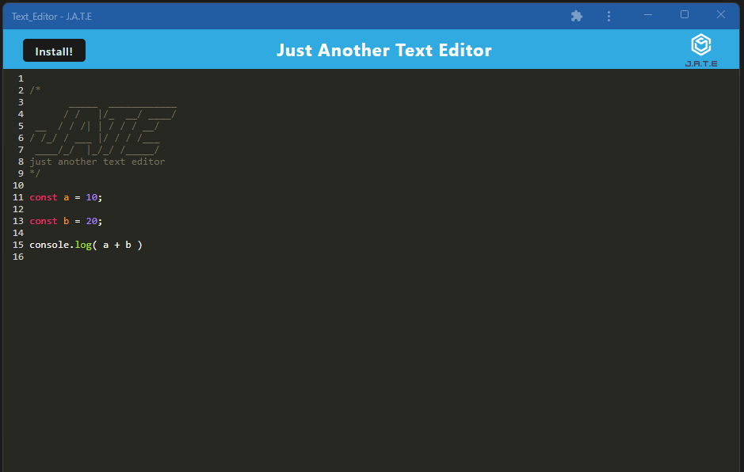

# Text Editor

## In this application, you will find a simple text editor that has javascript syntax highlighting. This application represents a Progressive Web Application in which the client and server sides are separated but function together. It also utilizes an IndexedDB as the database and service workers.

[Application Link](https://calm-escarpment-33592.herokuapp.com/)

---

## 

## Table of Contents
  - [Installation](#installation)
  - [Usage](#usage)
  - [License](#license)
  - [Contributing](#contributing)
  - [Tests](#tests)
  - [Questions](#questions)

---
## Installation

A user can clone the files found in this repo then install the required node packages by running `npm i` in the command-line application. Next, run the command `npm run start` in terminal to launch the application build.

## Usage

After installing the necessary node packages, and running the application build, navigate to the outputted folded `dist` in the client directory and open the `index.html` file. 

## License

This application is unlicensed

## Contributing

Visit my GitHub or Send me an email

## Tests

There are no tests written at this time

---
## Questions

If you have any questions, please visit my GitHub or send me an email.

[GitHub Link](https://github.com/momaki9)

[Email Me!](mailto:mostafa_m9@yahoo.com)